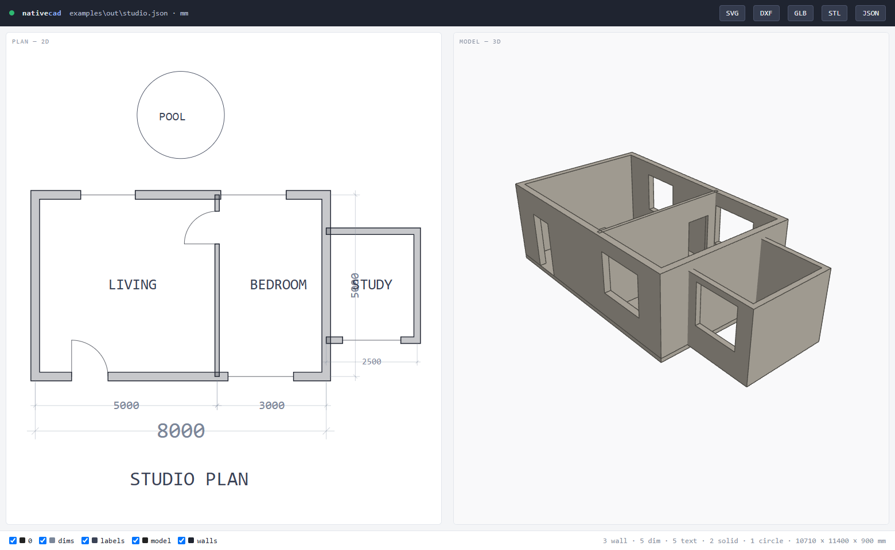
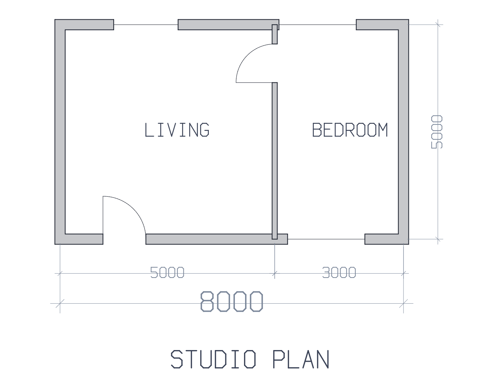
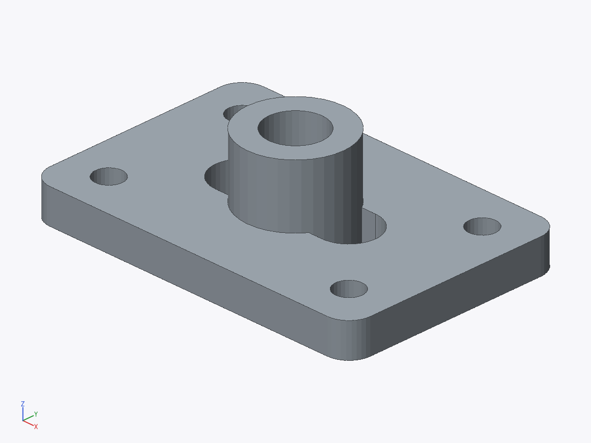
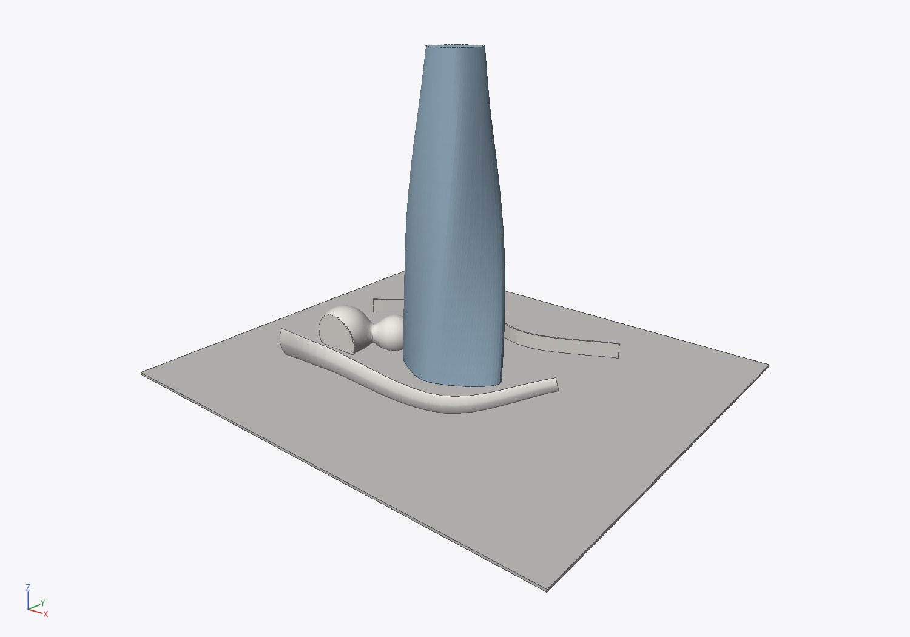
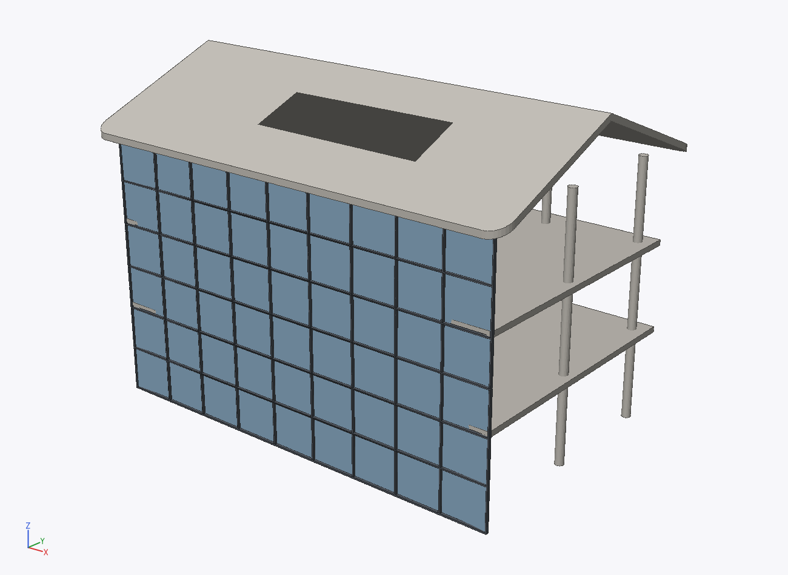
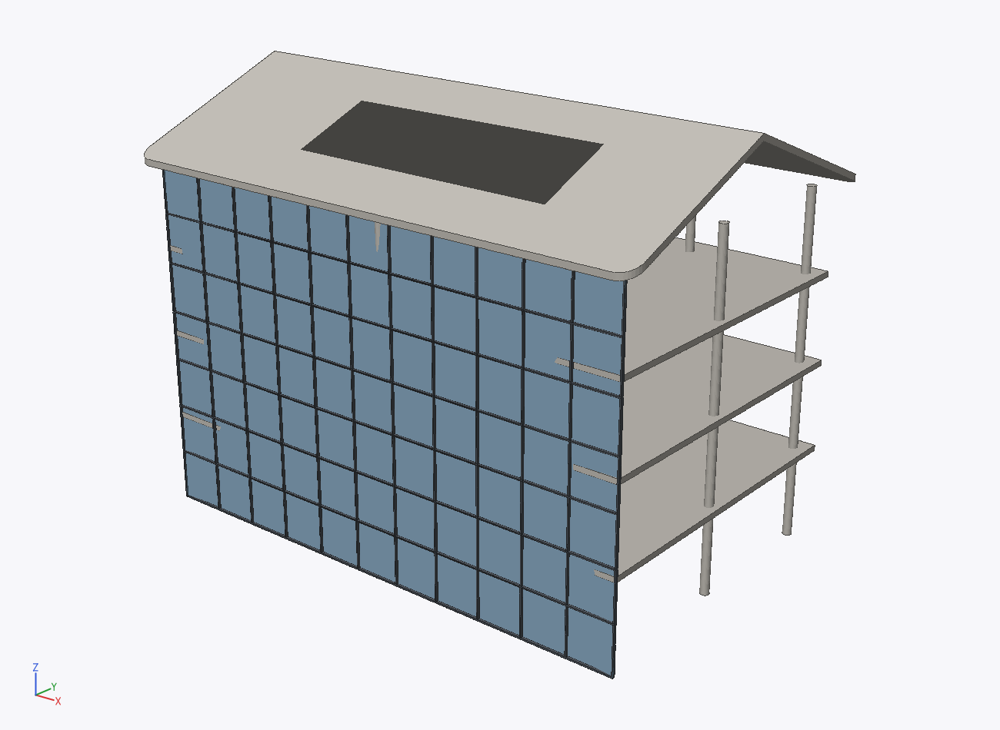

# Modulor

[](https://pypi.org/project/modulor/) [](https://github.com/bcllcc/modulor/actions/workflows/ci.yml) [](https://pypi.org/project/modulor/) [](LICENSE)

**Agent-native 的二维绘图 + 三维建模内核。没有 GUI，没有鼠标——JSON 进，几何出。**

> **English**: Modulor is an agent-native 2D drafting + 3D modeling kernel —
> the geometry layer for the agent era. No GUI: the entire tool is a
> self-describing JSON op protocol (71 ops, contract-tested) over a plain-JSON
> document format, callable via CLI, JSON-Lines pipe, MCP server or Python.
> Parametric recipes, architectural semantics, freeform surfaces, DXF/glTF
> interop, a built-in verification loop (measure / validate / render-and-see),
> and a conformance checker for the format. Agents read
> [AGENT_GUIDE.md](AGENT_GUIDE.md); the API contract lives in
> [docs/API.md](docs/API.md); the file format spec in
> [docs/FORMAT.md](docs/FORMAT.md). Named after Le Corbusier's *Modulor* —
> a universal measure for building, this time for machines.

传统 CAD软件 是为人类的眼睛和手设计的：菜单、视口、
捕捉、快捷键。Agent 调用它们时，要么模拟人类操作，要么穿过厚重的插件层。
Modulor 反过来：**把 CAD 的几何核心保留下来，把交互层整个换成 Agent 的母语**
——结构化命令、结构化结果、结构化错误，外加一条"渲染成图、亲眼验证"的反馈回路。

```
                ┌─────────────────────────────────────────┐
   Agent ──────▶│  CLI batch │ CLI pipe │ MCP │ Python API │
                └──────────────────┬──────────────────────┘
                                   ▼
                       JSON 命令（自描述 op 协议）
                                   ▼
                ┌─────────────────────────────────────────┐
                │  几何内核：manifold3d (Clipper2 + Manifold) │
                │  2D/3D 布尔 · 偏移 · 拉伸 · 旋转体 · 切片    │
                └──────────────────┬──────────────────────┘
                                   ▼
        .json 文档 · SVG · DXF · PNG 渲染 · OBJ / STL / GLB
```

## 核心能力（71 个自描述操作，接口受契约测试保护）

**身份与治理**：项目名/包名/CLI/格式标识已[正式冻结](GOVERNANCE.md)；
Standard（规格，供第三方实现）与 Core（参考实现，canonical 而非排他）的
边界、semver 与兼容政策、RFC 流程见 [GOVERNANCE.md](GOVERNANCE.md)。

标准的两半都已成文并由测试看守：**op 协议**——[docs/API.md](docs/API.md)
（由注册表生成）+ 机器可读契约 [docs/api.json](docs/api.json)，实现与契约
不一致时测试直接失败；**文档格式**——[docs/FORMAT.md](docs/FORMAT.md) 规格
+ [docs/document.schema.json](docs/document.schema.json)（JSON Schema），
每份示例文档都在 CI 里对着 schema 验证。

- **参数化（文档 = 数据 + 配方）**：任何数值字段接受表达式
  （`"bay*3"`、`"level_top('L2')"`、`"grid_x('B')"`）；`recipe_set` 把生成
  命令存进文档作为**设计意图**，`set_param` + `regenerate` 一条命令全模型
  联动重建——"柱距 4m 改 5m，其他保持联动"就是这两个调用
- **建筑语义**：轴网 add_grid（平面出轴线+编号气泡，交点可在表达式中引用）、
  标高 add_level、房间 add_room（平面自动标注名称+面积 m²）、
  面积报告 program（按名称/标高/类型汇总）、坡屋顶 add_roof（平/单坡/双坡）、
  楼梯 add_stair（自动按舒适度公式 2R+T=630 排踏步）、幕墙 add_facade
- **方案迭代**：snapshot / restore 快照，**diff** 对比两个方案
  （参数变更、实体增删改、体积面积增量），recipe 让设计意图跨方案继承

- **2D 制图**：线 / 多段线 / 样条曲线 / 圆 / 弧 / 矩形 / 文字、
  对齐·角度·半径标注（自动测量）、圆角 / 倒角、图层、2D 布尔、偏移
- **建筑墙体**：中心线画墙（直线、闭合环、**样条曲线墙**），门窗洞口按
  沿墙距离定位，平面图出双线+开启线，3D 自动成体
- **3D 建模**：体块 / 圆柱 / 球 / 拉伸（扭转、收分）/ 旋转体 /
  稳健 3D 布尔（Manifold 内核，不会产生破面）/ 切片 / 平面与立面投影 / 抽壳
- **自由形态（Agent 的主场）**：断面放样 loft（纵向样条插值出流动曲面）、
  沿空间路径扫掠 sweep、自由变形 deform（扭转/锥化/弯曲）、
  **隐式曲面 add_implicit**（用数学表达式雕塑形体，smin/smax 平滑融合）、
  网格平滑 smooth——Zaha 级别的异形语汇，全部走 JSON 命令
- **变换**：移动 / 复制 / 旋转 / 缩放 / 镜像 / 网格与环形阵列，2D/3D 通吃
- **反馈回路**：measure / validate / **find 空间查询** /
  **render labels=true 把实体 id 印在图上** / snapshot·restore 文档快照
- **互通**：导出 SVG · DXF · OBJ · STL · GLB(PBR) · **IFC4 语义 BIM**
  （墙带真洞口、标高/轴网/房间面积量，Revit/Archicad 直接打开）；**导入 DXF**
  （LINE/CIRCLE/ARC/POLYLINE 含弧段/TEXT/MTEXT/SPLINE/ELLIPSE + 图层颜色，
  不支持的类型计数报告，绝不静默丢弃）——Agent 可以接手人类的存量图纸
- **渲染**：纯 numpy 软件光栅器，平面图 PNG 与 3D 着色 PNG（特征边 + 坐标轴），
  多模态 Agent 可直接"看见"自己建的模型——MCP 的 `cad_render` 直接返回图像
- **实时查看器**：`modulor serve` 起一个**严格只读**的浏览器窗口
  （2D 平面 + WebGL 3D 轨道视图 + 图层开关 + 一键下载），监视文档文件，
  任何 Agent 通过任何通道修改文档，页面自动跟随刷新——人类看，Agent 干

## 安装

```
pip install modulor          # 内核依赖仅 numpy + manifold3d
pip install modulor[check]   # 可选：格式一致性校验（modulor check --strict）
```

开发安装：克隆本仓库后 `pip install -e .[dev]`，`pytest tests` 跑全部测试。

## 60 秒上手

```
modulor ops                      # 看所有命令（自描述，无需读文档）
modulor ops add_wall             # 看单个命令的参数/默认值/示例

echo [{"op":"add_box","size":[100,60,40]},{"op":"render","path":"a.png"}] > s.json
modulor run model.json s.json    # 批量执行（原子性：失败则不落盘）

modulor repl model.json          # 长会话：一行 JSON 进，一行 JSON 出
modulor mcp                      # MCP stdio 服务器
modulor serve model.json         # 只读查看器：浏览器实时跟随文档变化
```


*查看器：左 2D 平面（滚轮缩放/拖拽平移），右 WebGL 3D（轨道相机），
底部图层开关，顶部 SVG/DXF/GLB/STL 下载。零前端依赖，单文件 HTML，离线可用。*

MCP 客户端配置（如 Claude Code）：

```json
{"mcpServers": {"modulor": {"command": "modulor", "args": ["mcp"]}}}
```

## 示例

`modulor run out\studio.json examples\floorplan.json` —— 户型图：
闭合外墙环 + 隔墙 + 4 门窗 + 标注链 + 房间标签 → SVG/DXF/PNG → 一键长成
3D（含楼板）→ GLB。

`modulor run out\bracket.json examples\bracket.json` —— 机械零件：
偏移做圆角板 + 孔阵列 + 腰形槽（2D 布尔）→ 拉伸 → 凸台镗孔（3D 布尔）→
体积测量 → STL/GLB/OBJ + 剖面 DXF。

`modulor run out\zaha.json examples\zaha.json` —— 异形建筑：
三断面样条放样出流线塔楼（loft+twist）+ 飘带天蓬（sweep）+
样条曲线墙 + 隐式曲面融合展亭（add_implicit smin）→ GLB。

`modulor run out\param.json examples\parametric.json --as-recipe` ——
参数化建筑：5 个参数驱动轴网/标高/柱阵/楼板/幕墙/坡屋顶/楼梯/房间；
之后 `{"op":"regenerate","params":{"bay":5000,"floors":4}}` 一条命令，
整栋楼重新协调（OFFICE 面积 76.8m² → 120m²，diff 给出完整对比报告）。

| 建筑平面（双线墙、门扇、标注链） | 机械零件（2D/3D 布尔） | 异形建筑（放样/扫掠/隐式曲面） |
|---|---|---|
|  |  |  |

**参数化联动**——同一份配方，`{"op":"regenerate","params":{"bay":5000,"floors":4}}` 一条命令重建整楼：

| bay=4000 · 3 层 | bay=5000 · 4 层（regenerate 之后） |
|---|---|
|  |  |

规模参考（scripts/bench.py，20 层塔楼 401 条命令）：构建 0.08s、
文档 0.04MB（墙体参数化存储）、着色渲染 2.2s、GLB 导出 0.05s。

## 设计原则（Agent-native 的含义）

1. **命令即 API，API 即文档**：每个 op 自带参数 schema、默认值与示例，
   `help` 一个调用拿全；参数拼错会收到 "did you mean ..." 。
2. **一切皆可验证**：建完就能 `measure`、`validate`、`render`——Agent 不必
   盲信自己的输出。
3. **原子批处理**：批量命令要么全部成功落盘，要么报出第几条错在哪，文档不脏。
4. **用标签不用坐标 id**：布尔运算会消耗实体，`tag` 让选择器稳定。
5. **文档就是纯 JSON**：可 diff、可入库、可手改，没有二进制黑盒。

## 项目结构

```
modulor/
  document.py    文档模型（图层/材质/实体/选择器/序列化）
  engine.py      批处理执行器（原子性、结构化错误）
  geometry.py    向量/仿射/弧离散化/墙体轮廓偏移
  shapes.py      实体 <-> 几何内核（CrossSection/Manifold）桥
  ops/           全部操作：绘图、建模、参数化、建筑语义、变换、查询、导出
  exporters/     SVG · DXF · OBJ · STL · GLB（全部手写，零重依赖）
  render/        软件光栅器、笔画字体、2D/3D 渲染
  cli.py         run / op / repl / ops / new / info / serve / mcp
  mcp_server.py  MCP stdio 服务器（手写 JSON-RPC，无 SDK 依赖）
  viewer/        只读实时查看器（stdlib HTTP + 单文件 HTML + 自写 WebGL）
tests/           行为 + 契约 + 模糊测试（pytest）
examples/        户型图与机械零件全流程脚本
AGENT_GUIDE.md   给 Agent 看的完整使用指南
```

## License

MIT
